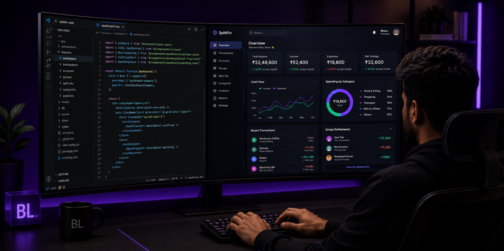

  

<h1 align="center">Hi, I'm Bhanuprasad L. 👋</h1>
<h3 align="center">Software Engineer · Frontend-Focused Full Stack</h3>

I build modern web products with React, Next.js and TypeScript — 
combining polished interfaces with application logic, APIs and data.  
Currently focused on building scalable product experiences and 
strengthening production-ready full-stack engineering.

  
  
  
  
  
  

## About Me

- 💻 Software Engineer with 2+ years of professional experience building modern web applications.
- ⚛️ Frontend-focused, working deeply with React, Next.js, TypeScript and responsive product interfaces.
- 🔗 Comfortable connecting frontend experiences with application state, REST APIs, authentication and backend workflows.
- 🗄️ Work with PostgreSQL, MongoDB and Prisma for application data and persistence.
- 🚀 Currently building **SplitFin**, a finance and shared-expense product covering tracking, bill splitting, settlements, bill scanning and analytics.
- 🏗️ Interested in scalable frontend architecture, maintainable feature structures, performance and real product engineering.
- 🌱 Currently deepening backend architecture, testing and production-ready full-stack patterns.

  

## Tech Stack

**Languages**

**Frontend**

**State & Application Data**

**Backend & APIs**

**Database & ORM**

**UI / Data Visualization**

**Auth / Platform Tools**

**Tools & Delivery**

## GitHub Stats

  

  
  

  

  
  

  

## Connect With Me

I'm open to software engineering opportunities, product-focused teams and interesting collaborations.

  
  
  
  

  Building products, improving systems, and learning through iteration.

  Thanks for visiting.

